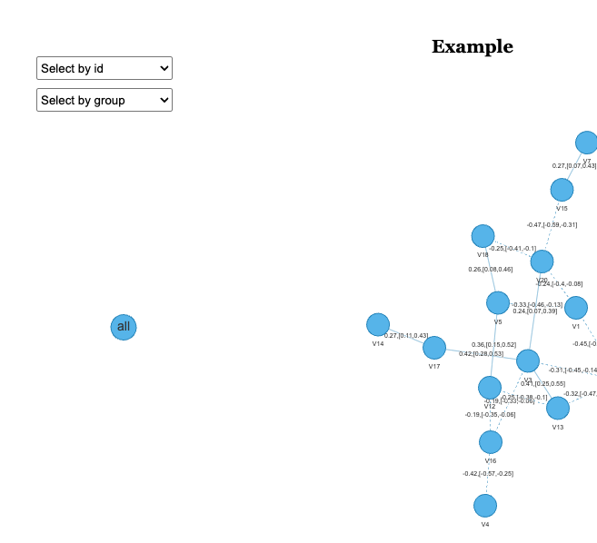
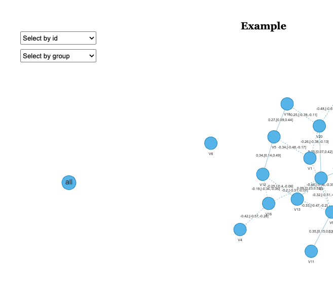

<!-- README.md is generated from README.Rmd. Please edit that file -->

# RSNet


  

**RSNet** is an R package that implements a resampling-based framework
for structure learning and analysis of Markov and conditional Gaussian
Bayesian (optional) networks.

**RSNet** supports multiple resampling strategies to improve the
stability and reliability of inferred network structures. For both
Markov and conditional Gaussian Bayesian networks, the framework
implements four general approaches:

1.  Bootstrap.
2.  Sub-sampling.
3.  Stratified bootstrap.
4.  Stratified sub-sampling.

For Markov networks, **RSNet** further provides cluster-based sampling
options specifically designed to accommodate correlated or family-based
data, including:

1.  Cluster-based bootstrap.
2.  Fractional cluster-based bootstrap.

Beyond structure learning, **RSNet** includes a suite of network
analysis tools containing standard network metrics, graphlet-based
analysis, and differential connectivity analysis.

Please see our [documentation](https://montilab.github.io/RSNet/) for
additional examples.

# Installation

- Using `devtools` package

``` r
library(devtools)
devtools::install_github("montilab/RSNet")
```

# Usage

**IMPORTANT NOTE**: The Conditional Gaussian Bayesian Network
functionalities `ensemble_cgbn` and `consensus_net_cgbn` are optional in
**RSNet** and require the `RHugin` package. Installation instructions
for
[macOS](https://rhugin.r-forge.r-project.org/InstallingRHuginMacOSX.html),
[windows](https://rhugin.r-forge.r-project.org/InstallingRHuginWindows.html),
and
[Linux](https://rhugin.r-forge.r-project.org/InstallingRHuginLinux.html).

The following example demonstrates the usage of **RSNet** with a
synthetic dataset.

## (i) Load R packages

``` r
library(RSNet)
library(DT)
```

## (ii) Prepare input dataset

The core functions, `ensemble_ggm()` and the optional `ensemble_cgbn()`,
accept an *n × p* data frame or matrix with both row and column names,
where *n* represents the number of observations (samples) and *p*
denotes the number of features. In the following example, we illustrate
the workflow using a simulated toy dataset containing 100 observations
and 20 features.

``` r
data(toy_er)
print(dim(toy_er$dat))
[1] 100  20
```

## (iii) Run and learn an ensemble of networks from resampled datasets

In this example, we use the simulated dataset as input and perform
bootstrap resampling (`boot = TRUE`) with 100 iterations
(`num_iteration = 100`). To estimate empirical confidence intervals for
each edge, set `estimate_CI = TRUE`; for improved memory efficiency,
this option can be disabled (`estimate_CI = FALSE`). Both
`ensemble_ggm()` and the optional `ensemble_cgbn()` functions support
parallel computation through the `n_cores` parameter.

The wrapper function `capture_all()` can be used to suppress messages
generated during the execution of `ensemble_ggm()`.

``` r
ensemble_er <- capture_all(
  ensemble_ggm(
    dat = toy_er$dat,     # A n x p dataframe/matrix
    num_iteration = 100,  # Number of resampling iteration
    boot = TRUE,          # If FALSE, perform sub-sampling
    sub_ratio = NULL,     # Subsampling ratio (0–1)
    sample_class = NULL,  # Optional: for stratified sampling
    correlated = FALSE,   # If TRUE, then clusted-based resampling is performed
    cluster_ratio = 1,    # Used only when `correlated = TRUE`
    estimate_CI = TRUE,   # If TRUE, estimate the empirical confidence interval
    method = "D-S_NW_SL", # Inference method
    n_cores = 1           # Number of cores for parallel computing
  )
) 
```

## (iv) Construct the consensus network

We then integrate the ensemble of inferred networks to construct a
consensus network, designed to filter out spurious edges introduced by
noise and to facilitate downstream analyses. The `consensus_net_ggm()`
function takes the output of `ensemble_ggm` as its primary input, while
the optional `consensus_net_cgbn()` function operates on the output of
`ensemble_cgbn()`.

Edges in the consensus network can be filtered based on their
significance using the filter parameter: nominal p-value
(`filter = "pval"`), Benjamini–Hochberg adjusted p-value
(`filter = "fdr"`), or no filtering (`filter = "none"`). If
`estimate_CI = TRUE` was specified in the `ensemble_ggm()` step, edges
whose confidence intervals include zero are automatically excluded.

``` r
consensus_er <- consensus_net_ggm(
  ggm_networks = ensemble_er, # The output of "ensemble_ggm()"
  CI = 0.95,                  # Confidence interval
  filter = "pval",            # Filter method
  threshold = 0.05            # Significant level of the selected filter
)
```

## (v) Interactive visualization

**RSNet** supports interactive visualization for downstream analyses.
Although the `plot_cn()` function is primarily designed to visualize
consensus networks, it can accept any `igraph` object as its first
argument. The function generates an interactive network plot along with
a list object containing node and edge attributes.

Additionally, by specifying the `query` argument as a character vector,
users can visualize the subgraph induced by the queried nodes and their
neighbors up to the specified order (via the `order` parameter).

Confidence interval visualization is available only when the following
conditions are met:

1.  `CI_show = TRUE`

2.  `edge_label == "pcor"`

3.  Both `lower_quantile` and `upper_quantile` are included in the edge
    attributes

``` r
p <- plot_cn(
  ig = consensus_er$consensus_network, # An "igraph" object
  query = NULL,        # Node of interests, NULL or a character vector
  order = 1,           # Order of neighbors
  edge_label = "pcor", # The edge attribute to be shown
  CI_show = TRUE,      # Show empirical confidence interval
  main = "Example"     # Title
)
p$p
```

<!-- -->

## (vi) Centrality analysis

**Centrality analysis** is a classical approach in network analysis used
to quantify the relative importance or influence of individual nodes
within a network. RSNet implements this functionality through the
`centrality()` function, which computes several commonly used centrality
measures, including **degree**, **strength**, **eigenvector**,
**betweenness**, **closeness**, and **PageRank** centralities, using an
igraph object as input. For weighted networks, users can specify the
`weight` parameter to indicate the edge attribute representing the
desired weighting scheme.

``` r
centrality(ig = consensus_er$consensus_network, weight = NULL) |>
  as.matrix(.) |> 
  round(., 4) |> 
  as.data.frame(.) |>
  head(.) |> 
  DT::datatable(.)
```

<!-- -->

# Acknowledgements

This project is funded by
