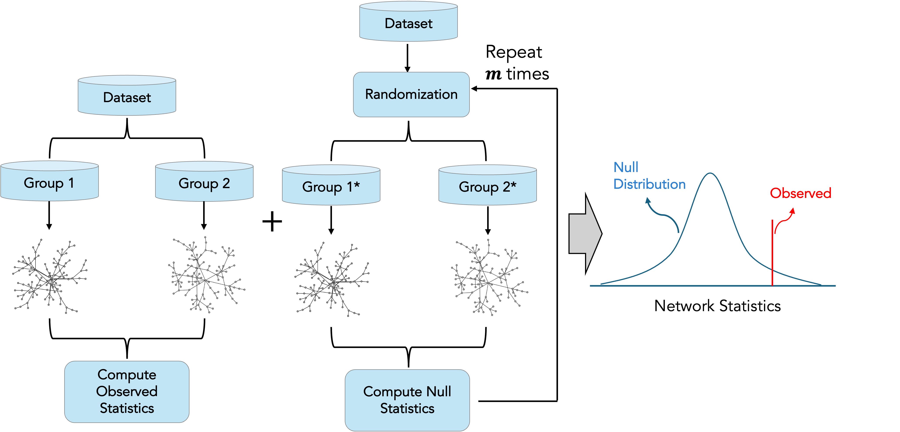

# Markov Networks-based Differential Connectivity Analysis

## Introduction

**Differential connectivity analysis** is an important application in
network-based studies, aimed at characterizing **network rewiring
patterns** of interacting entities across different conditions or
phenotypes. Unlike univariate analyses that evaluate features
independently, this approach captures **integrative, system-level**
signals arising from the collective behavior of interacting entities,
thereby providing complementary insights into underlying mechanisms.

*RSNet* supports differential connectivity analysis for datasets
containing samples from two groups (e.g., young vs. old, disease
vs. healthy) and enables statistical assessment of a wide range of
network-based statistics, including centrality measures and graphlet
degree vector (GDV)–based distances.The overall workflow is illustrated
in the following figure. Briefly, the input dataset is partitioned into
two mutually exclusive subsets corresponding to the groups of interest.
Network structure inference is then performed separately for each
subset, and the observed differences in network-based statistics are
computed.

To assess statistical significance, *RSNe*t constructs a
**resampling-based empirical null distribution** by randomizing the
original dataset using **permutation** and/or **bootstrap** procedures.
The significance of the observed network differences is subsequently
evaluated by comparing the observed statistics to the corresponding null
distributions.



## Load packages

``` r
library(RSNet)
library(igraph)
library(DT)
```

## Load LOAD dataset

Here, we use a curated dataset derived from a [late-onset Alzheimer’s
disease (LOAD) study](https://pubmed.ncbi.nlm.nih.gov/23622250/).

Here we used a real, and curated dataset derived from late-onset
Alzheimer’s disease (LOAD)
study[link](https://pubmed.ncbi.nlm.nih.gov/23622250/). The dataset
includes 129 **LOAD** subjects and 101 **control** subjects. For
demonstration and computational efficiency, we use only a subset of
genes with the highest median absolute deviation (MAD).

``` r
data(toy_load)
```

## Estimate observed networks

The observed networks are constructed by splitting the dataset into two
groups based on the phenotype of interest, **LOAD** versus **Control**.
Each subset of the data is then used as input to the resampling-based
framework implemented in *RSNet*. The resulting networks derived from
each group are stored as a named list object for downstream analyses.

``` r
## split the data into two groups
ctrl_dat <- toy_load %>% 
  dplyr::filter(phenotype == "ctrl") %>% 
  dplyr::select(-phenotype)

load_dat <- toy_load %>% 
  dplyr::filter(phenotype == "load") %>% 
  dplyr::select(-phenotype)


## Infer observed networks from each group
ctrl_obs <- capture_all(ensemble_ggm(dat = ctrl_dat,
                         num_iteration = 1,
                         sub_ratio = 1,
                         method = "D-S_NW_SL",
                         n_cores = 1)) %>% 
  consensus_net_ggm(., filter = "pval", threshold = 0.05) %>% 
  { .[["consensus_network"]] }

load_obs <- capture_all(ensemble_ggm(dat = load_dat,
                         num_iteration = 1,
                         sub_ratio = 1,
                         method = "D-S_NW_SL",
                         n_cores = 1)) %>% 
  consensus_net_ggm(., filter = "pval", threshold = 0.05) %>% 
  { .[["consensus_network"]] }


## Create a list of observed networks
obs_networks <- list(ctrl = ctrl_obs,
                     load = load_obs)
```

## Estimate the null distribution

Accurate estimation of the null distribution is essential for assessing
statistical significance. owever, for most network-based statistics, the
null distribution is difficult to derive analytically. *RSNet* addresses
this challenge by implementing **resampling-based null distribution
generation** via **permutation** and **bootstrap** methods. These
procedures are implemented in the
[`null_ggm()`](https://montilab.github.io/RSNet/reference/null_ggm.md)
function.

Because null generation can be computationally intensive,
[`null_ggm()`](https://montilab.github.io/RSNet/reference/null_ggm.md)
also supports **parallel computing** for improved efficiency.

In the following example, we generate two null distributions, one using
permutation and one using bootstrap, each with five iterations.

``` r
shuffle_iter <- 5

null_permutation <- capture_all(null_ggm(dat = toy_load, # a n x (p+1) data frame with p numeric feature columns + one label column.
                             group_col = "phenotype", # name of the label (phenotype) column
                             inference_method = "D-S_NW_SL", # the inference method
                             shuffle_method = "permutation", # shuffling method
                             shuffle_iter = shuffle_iter, # number of iteration
                             filter = "pval", # filter criteria, support "pval", "fdr", and "none"
                             threshold = 0.05, # the significance level
                             n_cores = 1)) # number of cores for parallel computing

null_bootstrap <- capture_all(null_ggm(dat = toy_load,
                           group_col = "phenotype",
                           inference_method = "D-S_NW_SL",
                           shuffle_method = "bootstrap",
                           shuffle_iter = shuffle_iter,
                           filter = "pval",
                           threshold = 0.05,
                           n_cores = 1))

## A list of length "shuffle_iter"; each element is a named list (by group labels) of igraph objects
stopifnot(length(null_permutation$null_networks) == shuffle_iter)
stopifnot(length(null_bootstrap$null_networks) == shuffle_iter)
```

## Differential centralities

*RSNet* supports differential analysis of standard centrality measures,
including degree, eigenvector, and betweenness centralities, etc. This
functionality is implemented in the
[`diff_centrality()`](https://montilab.github.io/RSNet/reference/diff_centrality.md)
function, which takes as input the observed networks。

Internally,
[`diff_centrality()`](https://montilab.github.io/RSNet/reference/diff_centrality.md)
calls the
[`null_ggm()`](https://montilab.github.io/RSNet/reference/null_ggm.md)
function to generate the null distribution. For improved memory
efficiency, users can alternatively run
[`null_ggm()`](https://montilab.github.io/RSNet/reference/null_ggm.md)
separately and supply its output to the `null_networks` argument.

The
[`diff_centrality()`](https://montilab.github.io/RSNet/reference/diff_centrality.md)
function supports both **permutation-based** and **bootstrap-based**
randomization procedures, and allows for **one-sided** or **two-sided**
hypothesis testing.

``` r
diff_centrality_res <- capture_all(diff_centrality(obs_networks = obs_networks,
                                       dat = toy_load,
                                       group_col = "phenotype",
                                       null_networks = NULL,
                                       alternative = "two.sided",
                                       inference_method = "D-S_NW_SL",
                                       shuffle_method = "permutation",
                                       shuffle_iter = 5,
                                       balanced = FALSE,
                                       filter = "pval",
                                       threshold = 0.05,
                                       n_cores =  1,
                                       seed = 42))

diff_centrality_res %>% 
  head(.) %>% 
  DT::datatable(.)
```

## Differential graphlet degree vector(GDV)-based distance

In addition to differential analysis of standard centrality measures,
*RSNet* also supports **graphlet degree vector (GDV)-based distance**
analysis (see the *Graphlet* page for details). This functionality is
implemented in the
[`diff_gdv()`](https://montilab.github.io/RSNet/reference/diff_gdv.md)
function.

The arguments of
[`diff_gdv()`](https://montilab.github.io/RSNet/reference/diff_gdv.md)
are similar to those of
[`diff_centrality()`](https://montilab.github.io/RSNet/reference/diff_centrality.md).
However,
[`diff_gdv()`](https://montilab.github.io/RSNet/reference/diff_gdv.md)
currently supports only **permutation-based** randomization procedures
and performs **one-sided** hypothesis testing, consistent with the
statistical characteristics of the GDV distance measure.

``` r
diff_gdv_res <- capture_all(diff_gdv(obs_networks = obs_networks,
                         dat = toy_load,
                         group_col = "phenotype",
                         null_networks = NULL,
                         sign = TRUE,
                         inference_method = "D-S_NW_SL",
                         shuffle_method = "permutation",
                         shuffle_iter = 5,
                         balanced = FALSE,
                         filter = "pval",
                         threshold = 0.05,
                         n_cores =  1,
                         seed = 42))

diff_gdv_res %>% 
  head(.) %>% 
  DT::datatable(.)
```

### 
