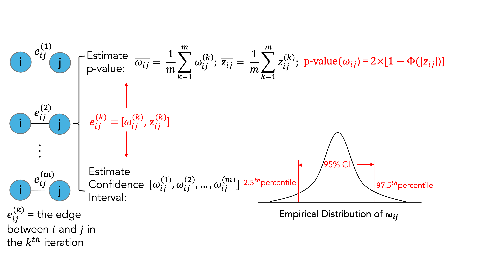

```{r setup, include=FALSE}
knitr::opts_chunk$set(echo = TRUE, message = FALSE, warning = FALSE)
```

# Introduction

Gaussian networks, also known as **Gaussian graphical models (GGMs)**, are a class of probabilistic graphical models that provide a natural, graph-based framework for characterizing conditional dependencies among interacting entities in complex systems. GGMs adopt an undirected Markov graph representation, where vertices correspond to random variables assumed to follow a multivariate Gaussian distribution, and edges represent conditional dependencies between pairs of variables, quantified through nonzero partial correlations.

In contrast to correlation-based networks, which model marginal dependencies, Gaussian networks explicitly characterize the dependence between two variables while conditioning on all remaining variables in the system. This conditioning property enables GGMs to distinguish direct from indirect associations, yielding more parsimonious and interpretable network representations. As illustrated in the following figure, distinct conditional dependency structures in a Gaussian network can give rise to identical marginal correlation patterns, highlighting a fundamental limitation of correlation-based approaches. These advantages have led to the widespread adoption of Gaussian networks for inferring system-level dependency structures from high-dimensional data.

```{r echo=FALSE, out.height="80%", out.width="80%"}
knitr::include_graphics("figs/ggm.png")
```

# Load packages
```{r, message=FALSE}
library(RSNet)
library(DT)
```

# Resampling-based framework for Gaussian network inference

**RSNet** implements multiple resampling strategies to enhance the stability and reliability of inferred network structures. For Gaussian networks, users can choose among four general resampling approaches: (1) unstratified bootstrap, (2) unstratified subsampling, (3) stratified bootstrap, and (4) stratified subsampling, depending on data characteristics and study design. In addition, **RSNet** supports cluster-based resampling methods specifically designed for correlated or family-based datasets, including (1) cluster bootstrap, which samples entire clusters with replacement to preserve intra-cluster dependencies, and (2) fractional cluster bootstrap, which samples only a subset of clusters with replacement.

The overall workflow is illustrated in the following figures. Briefly, a feature-by-sample dataset is provided as input and subjected to a user-specified resampling strategy over a specified number of iterations, yielding an ensemble of resampled datasets. Each resampled dataset is then used for network structure inference, producing an ensemble of inferred networks. Finally, these networks are integrated to construct a single consensus network that serves as the basis for downstream analyses.

```{r echo=FALSE, out.height="80%", out.width="80%"}
knitr::include_graphics("figs/ggm_resampling.png")
```

These procedures are implemented in the function `ensemble_ggm()`, which leverages structure inference algorithms from the `SILGGM` package. The resampling module supports parallel computing, enabling efficient large-scale network inference and ensuring scalability for high-dimensional datasets.

In the following example, we use a synthetic dataset as input and perform bootstrap resampling (`boot = TRUE`) with 100 iterations (`num_iteration = 100`). To estimate empirical confidence intervals for each edge, set `estimate_CI = TRUE`; for improved memory efficiency, this option can be disabled (`estimate_CI = FALSE`). The function `ensemble_ggm()`support parallel computation through the `n_cores` parameter.

```{r, eval=FALSE}
data(toy_er)
ensemble_toy <- ensemble_ggm(
  dat = toy_er$dat,     # A n x p dataframe/matrix
  num_iteration = 100,  # Number of resampling iteration
  boot = TRUE,          # If FALSE, perform sub-sampling
  sub_ratio = NULL,     # Subsampling ratio (0–1)
  sample_class = NULL,  # Optional: for stratified sampling
  correlated = FALSE,   # If TRUE, then clusted-based resampling is performed
  cluster_ratio = 1,    # Used only when `correlated = TRUE`
  estimate_CI = TRUE,   # If TRUE, estimate the empirical confidence interval
  method = "D-S_NW_SL", # Inference method
  n_cores = 1           # Number of cores for parallel computing
) 
```

# Consensus network construction

We illustrate the consensus network construction at the **single-edge level**. Let $e_{ij}^{(k)}$ denote the inferred edge between variables $i$ and $j$ in the $k^{th}$ resampling iteration. Each edge $e_{ij}^{(k)}$ is associated with a precision (or partial correlation) estimate $\omega_{ij}^{(k)}$ and its corresponding z-score $z_{ij}^{(k)}$.

The statistical significance of edge $e_{ij}$ in the consensus network is assessed using the **average z-score across $m$ resampling iterations**,from which a two-sided p-value is computed. When the argument `estimate_CI = TRUE`is enabled in `ensemble_ggm()`, the values $\omega_{ij}^{(k)}$ and $z_{ij}^{(k)}$ are retained for each resampling iteration, thereby enabling the estimation of **empirical confidence intervals**.

```{r echo=FALSE, out.height="80%", out.width="80%"}

```

The construction of the consensus network is implemented in the function `consensus_net_ggm()`, which takes the output of `ensemble_ggm()` as its input. Edges in the consensus network can be filtered based on statistical significance using the `filter` argument, with options including the nominal p-value (`filter = "pval"`), the Benjamini–Hochberg adjusted 
p-value (`filter = "fdr"`), or no filtering (`filter = "none"`). When `estimate_CI = TRUE` is specified during the `ensemble_ggm()` step, edges whose empirical confidence intervals include zero are automatically excluded from the consensus network.

```{r,eval=FALSE}
consensus_toy <- consensus_net_ggm(
  ggm_networks = ensemble_toy, # The output of "ensemble_ggm()"
  CI = 0.95,                   # Confidence interval
  filter = "pval", # Filter method
  threshold = 0.05
) # Significant level of the selected filter
```


</font>
--

